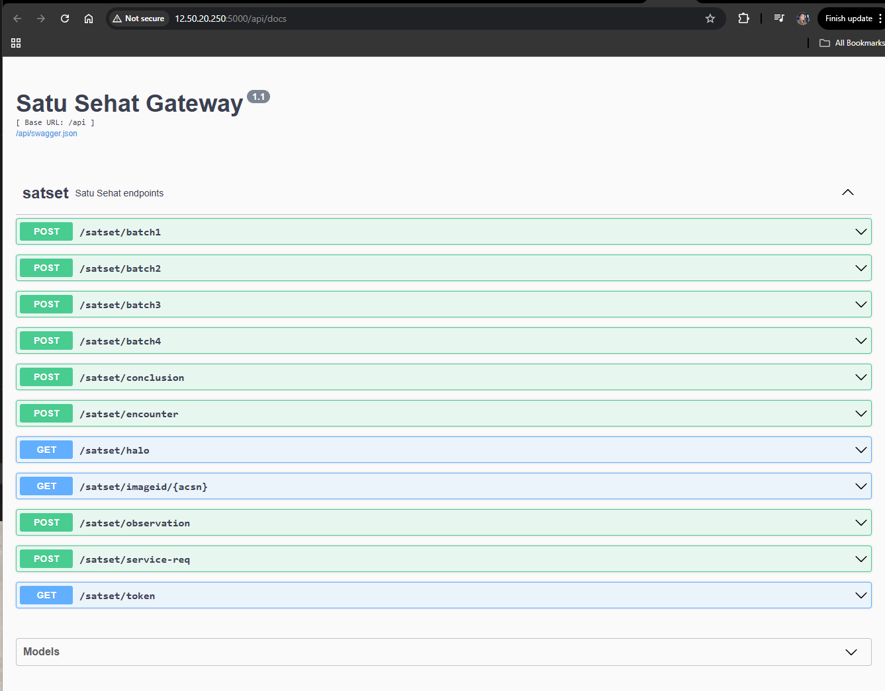
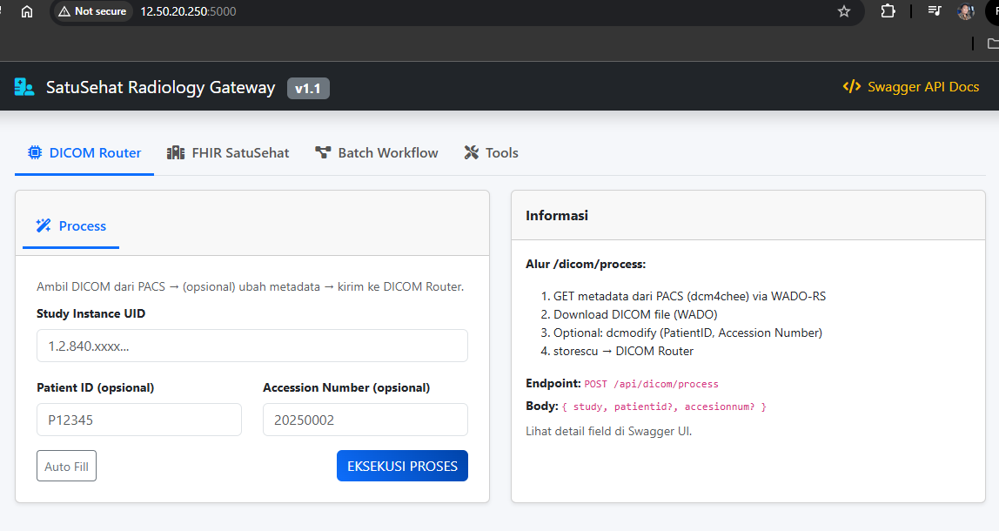
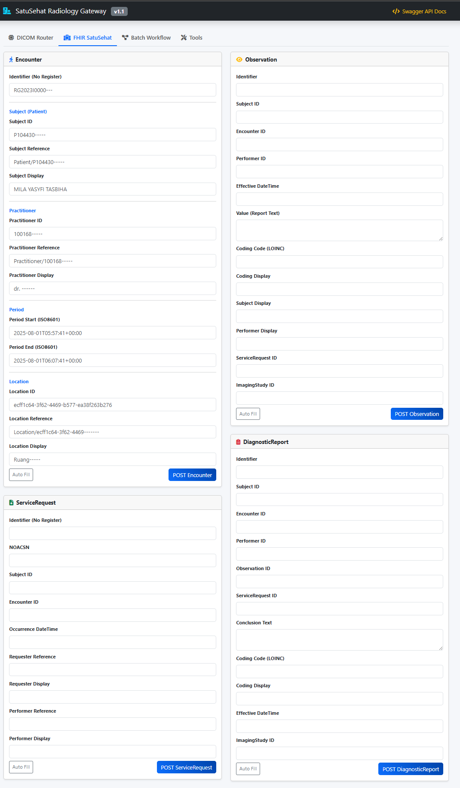
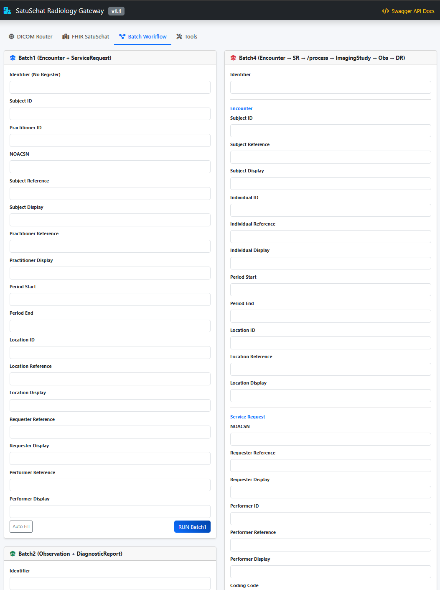
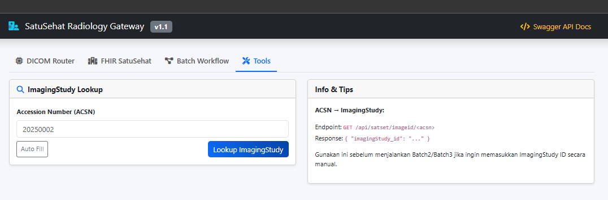

# Menyiapkan virtual environment Python dan menginstal Flask

Panduan singkat untuk membuat virtual environment, mengaktifkannya (macOS zsh),
dan menginstal `flask` serta `flask-restx`.

**Prasyarat**: Python 3.8+ terpasang. Periksa dengan:

```bash
python3 --version
```

1) Buat virtual environment di direktori proyek:

```bash
python3 -m venv .venv
```

2) Aktifkan virtual environment (macOS / zsh):

```bash
source .venv/bin/activate
```

3) Perbarui `pip` dan install paket yang diperlukan:

```bash
pip install --upgrade pip
pip install flask flask-restx
```

4) Verifikasi instalasi:

```bash
python -c "import flask, flask_restx; print('Flask', flask.__version__, 'Flask-RESTX', flask_restx.__version__)"
```

5) (Opsional) Simpan dependensi ke `requirements.txt`:

```bash
pip freeze > requirements.txt
```

6) Untuk keluar/menonaktifkan virtual environment:

```bash
deactivate
```

### SatuSehat Gateway + Radiology Workflow + DICOM Router
```markdown
# 🏥 SatuSehat Radiology Gateway & DICOM Router API

SatuSehat Radiology Gateway adalah layanan API modular yang mengintegrasikan:

- **FHIR SatuSehat** (Encounter, ServiceRequest, Observation, DiagnosticReport)
- **Radiology Workflow Automation** (Batch1–Batch4)
- **DICOM PACS (dcm4chee)** → **DICOM Router** (storescu)
- **ImagingStudy Lookup** berdasarkan ACSN
- **DICOM Processing** (WADO download → dcmodify → storescu)

API ini dirancang untuk workflow radiologi modern yang terintegrasi penuh dari **pendaftaran pasien → permintaan pemeriksaan → pengiriman DICOM → hasil bacaan → laporan radiologi**.
```
---

# 📂 Struktur Proyek
```
project/
│── app.py
│── config.py
│
├── satusehat/
│   ├── routes.py
│   ├── service_encounter.py
│   ├── service_servicereq.py
│   ├── service_observation.py
│   ├── service_diagnostic.py
│   ├── service_imaging.py
│   ├── service_dicom.py
│   ├── service_batch1.py
│   ├── service_batch2.py
│   ├── service_batch3.py
│   └── service_batch4.py
│
└── common/
├── auth.py
└── fhir_client.py
```

Semua endpoint dipisahkan secara modular untuk memudahkan maintenance, debugging, dan pengembangan.

---

# ⚙️ Konfigurasi (config.py)

```python
DCM4CHEE_URL
ROUTER_IP
ROUTER_PORT
ROUTER_AET

SS_AUTH_URL
SS_BASE_URL
SS_ORG_ID
SS_CLIENT_ID
SS_CLIENT_SECRET

TEMP_DIR
LOG_FILE

Semua konfigurasi dapat diatur melalui environment variable.

🚀 Menjalankan Aplikasi

pip install -r requirements.txt

python app.py

API tersedia di:
http://localhost:5000/api
Swagger UI:
http://localhost:5000/api/docs
```
📚 API Specification
1. General Endpoints

| Endpoint | Method | Description                     |
|----------|--------|---------------------------------|
| /halo    | GET    | Health check                    |
| /token   | GET    | Mendapatkan access token SatuSehat |

2. FHIR Resource Endpoints

| Endpoint      | Method | Description                | Body                  |
|---------------|--------|----------------------------|-----------------------|
| /encounter    | POST   | Membuat Encounter          | EncounterInput        |
| /service-req  | POST   | Membuat ServiceRequest     | ServiceRequestInput   |
| /observation  | POST   | Membuat Observation        | ObservationInput      |
| /conclusion   | POST   | Membuat DiagnosticReport   | DiagnosticReportInput |

3. Batch Workflow Endpoints

| Endpoint | Method | Workflow                                                                 | Output                                                                                                   |
|----------|--------|--------------------------------------------------------------------------|----------------------------------------------------------------------------------------------------------|
| /batch1  | POST   | Encounter → ServiceRequest                                               | { encounter_id, service_request_id }                                                                     |
| /batch2  | POST   | Observation → DiagnosticReport                                          | { observation_id, diagnostic_report_id }                                                                 |
| /batch3  | POST   | Encounter → ServiceRequest → ImagingStudy → Observation → DiagnosticReport | { encounter_id, service_request_id, imaging_study_id, observation_id, diagnostic_report_id }             |
| /batch4  | POST   | Encounter → ServiceRequest → /process (send DICOM) → ImagingStudy → Observation → DiagnosticReport | { encounter_id, service_request_id, dicom_process, imaging_study_id, observation_id, diagnostic_report_id } |

4. ImagingStudy Lookup

| Endpoint  | Method | Description                              |
|-----------|--------|------------------------------------------|
| /imageid/ | GET    | Lookup ImagingStudy berdasarkan ACSN     |

5. DICOM Router Processing

| Endpoint        | Method | Description                                      |
|-----------------|--------|--------------------------------------------------|
| /dicom/process  | POST   | Ambil DICOM dari PACS → edit tag → kirim ke Router |

🩻 Radiology Workflow Diagram

```Kode
Encounter
   ↓
ServiceRequest
   ↓
DICOM Acquisition (Modality)
   ↓
PACS (dcm4chee)
   ↓
/dicom/process → Router
   ↓
ImagingStudy
   ↓
Observation (Reading Result)
   ↓
DiagnosticReport (Radiology Report)
```
🧪 Contoh Request /batch4
```json
{
  "identifier_value": "RG2023I0000175",
  "subject_id": "P10443013727",
  "individual_id": "10016869420",
  "period_start": "2025-08-01T05:57:41+00:00",
  "noacsn": "20250002",
  "performer_id": "10000504193",
  "performer_value": "Tidak tampak kelainan",
  "conclusion_text": "Tidak tampak bercak pada kedua lapangan paru",
  "study": "1.2.840.113619.2.55.3.604688433.783.159975"
}
```
🧾 Contoh Response /batch4
```json
{
  "encounter_id": "015aa41f-88d7-4b0b-b5f1-d511522bfa87",
  "service_request_id": "f3a9c1d2-77c4-4e2b-9a55-1b2c3d4e5f6a",
  "dicom_process": {
    "status": "success",
    "study_uid": "1.2.840.113619.2.55.3.604688433.783.159975",
    "router": "192.10.10.51:11112"
  },
  "imaging_study_id": "75b7e9d0-c079-419c-84f8-8dba7b9cd585",
  "observation_id": "82b9af58-c98d-4263-9a6f-9a04fdfec43a",
  "diagnostic_report_id": "b9283cb6-b7d2-4cd4-8b3e-6e17f1ab1d9d"
}
```
🛠 Teknologi yang Digunakan

Flask + Flask-RESTX

FHIR R4 (SatuSehat)

dcm4chee PACS

dcmodify (dcmtk)

storescu (dcmtk)

WADO-RS

Python requests











